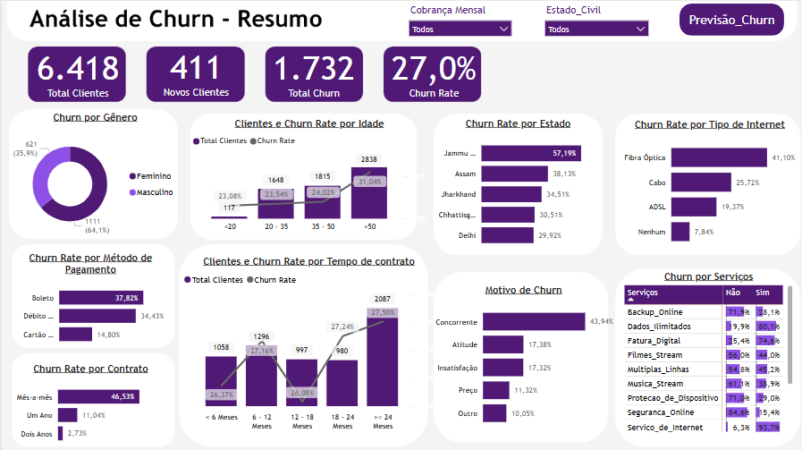
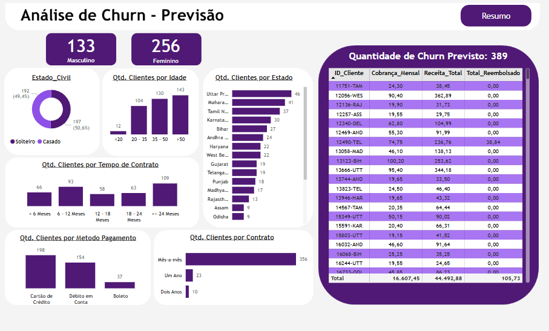

## Sobre o Projeto

O objetivo do projeto é gerar uma análise descritiva de clientes em estado de churn e análise preditiva de possíveis clientes que serão classificados em churn de uma empresa que oferece serviços de internet domiciliar e móvel.

Projeto de aprendizado desenvolvido a partir do canal [Pivotalstats](https://www.youtube.com/@pivotalstats), com modificações e análises realizadas por autoria própria.

---

## Principais perguntas e métricas

### Análise Descritiva (Resumo)

- Quantidade total de clientes;
- Churn Rate: % de clientes que deixam de utilizar os serviços;
- Motivos de churn;
- Churn Rate por idade, gênero e localização;
- Churn Rate por tipos de contrato, tempo de contrato e método de pagamento;
- Distribuição dos serviços em relação ao churn.

---

### Análise Preditiva

- Quantidade prevista de churn;
- Classificação de clientes por gênero, faixa etária, estado civil e região;
- Distribuição por tempo de contrato, método de pagamento e tipo de contrato.

## Análises

### Etapas

1. Processo ETL no SQL Server;
2. Limpeza e tradução de dados no SQL Server;
3. Transformações no Power BI;
4. Visualização e aprimoramento de visuais no Power BI;
5. Construir modelo de Machine Learning - Random Forest no Jupyter Notebook;
6. Visualizar dados de previsão no Power BI.

### Analise descritiva

- A porcentagem de clientes em churn representa 27% do total;
- O Churn Rate se manteve constante ao longo dos meses, entre 26% a 30%;
- O principal motivo de churn está relacionado ao método de pagamento (boleto) e ao tipo de contrato mensal, ambos oferecendo mais liberdade para o cancelamento;
- 43,94% dos churns ocorreram por migração de serviços para concorrentes com ofertas melhores, como mais velocidade, mais dados ou dispositivos superiores.

### Analise preditiva

- O modelo de Machine Learning identificou 389 potenciais casos de churn, representando uma possível perda de R$ 44.402,88.
- Diferente da análise descritiva, a maior parte de clientes utilizam pagamento por cartão de crédito.
- O perfil predominante de risco envolve clientes com contratos mensais, confirmando a tendência observada na análise descritiva.

